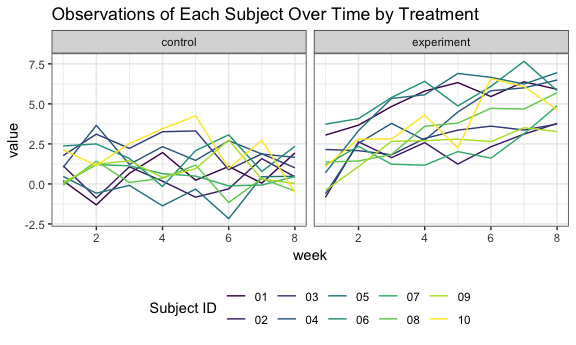

p8105\_hw5\_bs3142
================
Bingyu Sun
11/3/2018

Problem 1
---------

### Data import

``` r
read_study = function(flnm) {
  read_csv(flnm) %>%
    mutate(filename = flnm)
}

study_data = 
  list.files(path = "./data",
             pattern = "*.csv",
             full.names = TRUE) %>%
  map_df(~read_study(.x))
```

    ## Parsed with column specification:
    ## cols(
    ##   week_1 = col_double(),
    ##   week_2 = col_double(),
    ##   week_3 = col_double(),
    ##   week_4 = col_double(),
    ##   week_5 = col_double(),
    ##   week_6 = col_double(),
    ##   week_7 = col_double(),
    ##   week_8 = col_double()
    ## )
    ## Parsed with column specification:
    ## cols(
    ##   week_1 = col_double(),
    ##   week_2 = col_double(),
    ##   week_3 = col_double(),
    ##   week_4 = col_double(),
    ##   week_5 = col_double(),
    ##   week_6 = col_double(),
    ##   week_7 = col_double(),
    ##   week_8 = col_double()
    ## )
    ## Parsed with column specification:
    ## cols(
    ##   week_1 = col_double(),
    ##   week_2 = col_double(),
    ##   week_3 = col_double(),
    ##   week_4 = col_double(),
    ##   week_5 = col_double(),
    ##   week_6 = col_double(),
    ##   week_7 = col_double(),
    ##   week_8 = col_double()
    ## )
    ## Parsed with column specification:
    ## cols(
    ##   week_1 = col_double(),
    ##   week_2 = col_double(),
    ##   week_3 = col_double(),
    ##   week_4 = col_double(),
    ##   week_5 = col_double(),
    ##   week_6 = col_double(),
    ##   week_7 = col_double(),
    ##   week_8 = col_double()
    ## )
    ## Parsed with column specification:
    ## cols(
    ##   week_1 = col_double(),
    ##   week_2 = col_double(),
    ##   week_3 = col_double(),
    ##   week_4 = col_double(),
    ##   week_5 = col_double(),
    ##   week_6 = col_double(),
    ##   week_7 = col_double(),
    ##   week_8 = col_double()
    ## )
    ## Parsed with column specification:
    ## cols(
    ##   week_1 = col_double(),
    ##   week_2 = col_double(),
    ##   week_3 = col_double(),
    ##   week_4 = col_double(),
    ##   week_5 = col_double(),
    ##   week_6 = col_double(),
    ##   week_7 = col_double(),
    ##   week_8 = col_double()
    ## )
    ## Parsed with column specification:
    ## cols(
    ##   week_1 = col_double(),
    ##   week_2 = col_double(),
    ##   week_3 = col_double(),
    ##   week_4 = col_double(),
    ##   week_5 = col_double(),
    ##   week_6 = col_double(),
    ##   week_7 = col_double(),
    ##   week_8 = col_double()
    ## )
    ## Parsed with column specification:
    ## cols(
    ##   week_1 = col_double(),
    ##   week_2 = col_double(),
    ##   week_3 = col_double(),
    ##   week_4 = col_double(),
    ##   week_5 = col_double(),
    ##   week_6 = col_double(),
    ##   week_7 = col_double(),
    ##   week_8 = col_double()
    ## )
    ## Parsed with column specification:
    ## cols(
    ##   week_1 = col_double(),
    ##   week_2 = col_double(),
    ##   week_3 = col_double(),
    ##   week_4 = col_double(),
    ##   week_5 = col_double(),
    ##   week_6 = col_double(),
    ##   week_7 = col_double(),
    ##   week_8 = col_double()
    ## )
    ## Parsed with column specification:
    ## cols(
    ##   week_1 = col_double(),
    ##   week_2 = col_double(),
    ##   week_3 = col_double(),
    ##   week_4 = col_double(),
    ##   week_5 = col_double(),
    ##   week_6 = col_double(),
    ##   week_7 = col_double(),
    ##   week_8 = col_double()
    ## )
    ## Parsed with column specification:
    ## cols(
    ##   week_1 = col_double(),
    ##   week_2 = col_double(),
    ##   week_3 = col_double(),
    ##   week_4 = col_double(),
    ##   week_5 = col_double(),
    ##   week_6 = col_double(),
    ##   week_7 = col_double(),
    ##   week_8 = col_double()
    ## )
    ## Parsed with column specification:
    ## cols(
    ##   week_1 = col_double(),
    ##   week_2 = col_double(),
    ##   week_3 = col_double(),
    ##   week_4 = col_double(),
    ##   week_5 = col_double(),
    ##   week_6 = col_double(),
    ##   week_7 = col_double(),
    ##   week_8 = col_double()
    ## )
    ## Parsed with column specification:
    ## cols(
    ##   week_1 = col_double(),
    ##   week_2 = col_double(),
    ##   week_3 = col_double(),
    ##   week_4 = col_double(),
    ##   week_5 = col_double(),
    ##   week_6 = col_double(),
    ##   week_7 = col_double(),
    ##   week_8 = col_double()
    ## )

    ## Parsed with column specification:
    ## cols(
    ##   week_1 = col_double(),
    ##   week_2 = col_double(),
    ##   week_3 = col_double(),
    ##   week_4 = col_double(),
    ##   week_5 = col_double(),
    ##   week_6 = col_double(),
    ##   week_7 = col_integer(),
    ##   week_8 = col_double()
    ## )

    ## Parsed with column specification:
    ## cols(
    ##   week_1 = col_double(),
    ##   week_2 = col_double(),
    ##   week_3 = col_double(),
    ##   week_4 = col_double(),
    ##   week_5 = col_double(),
    ##   week_6 = col_double(),
    ##   week_7 = col_double(),
    ##   week_8 = col_double()
    ## )
    ## Parsed with column specification:
    ## cols(
    ##   week_1 = col_double(),
    ##   week_2 = col_double(),
    ##   week_3 = col_double(),
    ##   week_4 = col_double(),
    ##   week_5 = col_double(),
    ##   week_6 = col_double(),
    ##   week_7 = col_double(),
    ##   week_8 = col_double()
    ## )
    ## Parsed with column specification:
    ## cols(
    ##   week_1 = col_double(),
    ##   week_2 = col_double(),
    ##   week_3 = col_double(),
    ##   week_4 = col_double(),
    ##   week_5 = col_double(),
    ##   week_6 = col_double(),
    ##   week_7 = col_double(),
    ##   week_8 = col_double()
    ## )
    ## Parsed with column specification:
    ## cols(
    ##   week_1 = col_double(),
    ##   week_2 = col_double(),
    ##   week_3 = col_double(),
    ##   week_4 = col_double(),
    ##   week_5 = col_double(),
    ##   week_6 = col_double(),
    ##   week_7 = col_double(),
    ##   week_8 = col_double()
    ## )
    ## Parsed with column specification:
    ## cols(
    ##   week_1 = col_double(),
    ##   week_2 = col_double(),
    ##   week_3 = col_double(),
    ##   week_4 = col_double(),
    ##   week_5 = col_double(),
    ##   week_6 = col_double(),
    ##   week_7 = col_double(),
    ##   week_8 = col_double()
    ## )
    ## Parsed with column specification:
    ## cols(
    ##   week_1 = col_double(),
    ##   week_2 = col_double(),
    ##   week_3 = col_double(),
    ##   week_4 = col_double(),
    ##   week_5 = col_double(),
    ##   week_6 = col_double(),
    ##   week_7 = col_double(),
    ##   week_8 = col_double()
    ## )

### Data tidying

``` r
tidy_study =
  study_data %>%
  mutate(filename = str_replace_all(filename, c("^./data/" = "", ".csv$" = ""))) %>%
  separate(filename, into = c("treatment", "id"), sep = "_") %>%
  mutate(treatment = str_replace_all(treatment, c("con" = "control", "exp" = "experiment"))) %>%
  gather(key = week, value = value, week_1:week_8) %>%
  mutate(week = str_replace(week, "^week_", ""))
```

### Spaghetti plot

``` r
tidy_study %>%
  mutate(week = as.numeric(week)) %>%
  group_by(treatment, id) %>% 
  ggplot(aes(x = week, y = value, color = id)) +
  geom_line() +
  facet_grid(~treatment) +
  labs(
    title = "Observations of Each Subject Over Time by Treatment"
  ) +
  viridis::scale_color_viridis(
    name = "Subject ID",
    discrete = TRUE
  ) +
  scale_x_continuous(breaks = c(1:8))
```



Comment:

In general, there is an increase in performance over time in the experimental group comparing to the control group, suggesting a positive correlation between treatment and participants' performance.

Problem 2
---------

### Data import

``` r
cases_raw = read_csv("./homicide-data.csv")
```

    ## Parsed with column specification:
    ## cols(
    ##   uid = col_character(),
    ##   reported_date = col_integer(),
    ##   victim_last = col_character(),
    ##   victim_first = col_character(),
    ##   victim_race = col_character(),
    ##   victim_age = col_character(),
    ##   victim_sex = col_character(),
    ##   city = col_character(),
    ##   state = col_character(),
    ##   lat = col_double(),
    ##   lon = col_double(),
    ##   disposition = col_character()
    ## )

### Data manipulation

``` r
cases_tidy =
  cases_raw %>%
  mutate(city_state = str_c(city, ",", state)) %>% #get new variable city_state
  mutate(disposition = str_replace_all(disposition, c("Closed without arrest" = "Unsolved", "Open/No arrest" = "Unsolved"))) #combine two categories to one category called unsolved
```

#### Q & A

**1. Summarize within cities to obtain the total number of homicides, and the number of unsolved homicides (those for which the disposition is “Closed without arrest” or “Open/No arrest”).**

``` r
cases_nest =
  cases_tidy %>%
  group_by(city_state) %>%
  nest() %>%
  mutate(
    n_total = map(.x = data, ~ .x %>% 
                    pull(disposition) %>%
                    length()),
    n_unsolved = map(.x = data, ~ .x %>%
                       filter(disposition == "Unsolved") %>%
                       pull(disposition) %>%
                       length())
  ) %>%
  select(-data)

cases_nest %>%
  knitr::kable(digits = 0)
```

| city\_state       | n\_total | n\_unsolved |
|:------------------|:---------|:------------|
| Albuquerque,NM    | 378      | 146         |
| Atlanta,GA        | 973      | 373         |
| Baltimore,MD      | 2827     | 1825        |
| Baton Rouge,LA    | 424      | 196         |
| Birmingham,AL     | 800      | 347         |
| Boston,MA         | 614      | 310         |
| Buffalo,NY        | 521      | 319         |
| Charlotte,NC      | 687      | 206         |
| Chicago,IL        | 5535     | 4073        |
| Cincinnati,OH     | 694      | 309         |
| Columbus,OH       | 1084     | 575         |
| Dallas,TX         | 1567     | 754         |
| Denver,CO         | 312      | 169         |
| Detroit,MI        | 2519     | 1482        |
| Durham,NC         | 276      | 101         |
| Fort Worth,TX     | 549      | 255         |
| Fresno,CA         | 487      | 169         |
| Houston,TX        | 2942     | 1493        |
| Indianapolis,IN   | 1322     | 594         |
| Jacksonville,FL   | 1168     | 597         |
| Kansas City,MO    | 1190     | 486         |
| Las Vegas,NV      | 1381     | 572         |
| Long Beach,CA     | 378      | 156         |
| Los Angeles,CA    | 2257     | 1106        |
| Louisville,KY     | 576      | 261         |
| Memphis,TN        | 1514     | 483         |
| Miami,FL          | 744      | 450         |
| Milwaukee,wI      | 1115     | 403         |
| Minneapolis,MN    | 366      | 187         |
| Nashville,TN      | 767      | 278         |
| New Orleans,LA    | 1434     | 930         |
| New York,NY       | 627      | 243         |
| Oakland,CA        | 947      | 508         |
| Oklahoma City,OK  | 672      | 326         |
| Omaha,NE          | 409      | 169         |
| Philadelphia,PA   | 3037     | 1360        |
| Phoenix,AZ        | 914      | 504         |
| Pittsburgh,PA     | 631      | 337         |
| Richmond,VA       | 429      | 113         |
| San Antonio,TX    | 833      | 357         |
| Sacramento,CA     | 376      | 139         |
| Savannah,GA       | 246      | 115         |
| San Bernardino,CA | 275      | 170         |
| San Diego,CA      | 461      | 175         |
| San Francisco,CA  | 663      | 336         |
| St. Louis,MO      | 1677     | 905         |
| Stockton,CA       | 444      | 266         |
| Tampa,FL          | 208      | 95          |
| Tulsa,OK          | 583      | 193         |
| Tulsa,AL          | 1        | 0           |
| Washington,DC     | 1345     | 589         |

**2. For the city of Baltimore, MD, use the prop.test function to estimate the proportion of homicides that are unsolved; save the output of prop.test as an R object, apply the broom::tidy to this object and pull the estimated proportion and confidence intervals from the resulting tidy dataframe.**

``` r
bal_result = prop.test(cases_nest$n_unsolved[[3]], cases_nest$n_total[[3]])

tibble(
  estimate = broom::tidy(bal_result) %>% pull(estimate),
  conf.low = broom::tidy(bal_result) %>% pull(conf.low),
  conf.high = broom::tidy(bal_result) %>% pull(conf.high)
)
```

    ## # A tibble: 1 x 3
    ##   estimate conf.low conf.high
    ##      <dbl>    <dbl>     <dbl>
    ## 1    0.646    0.628     0.663

**3. Run prop.test for each of the cities in your dataset, and extract both the proportion of unsolved homicides and the confidence interval for each. Do this within a “tidy” pipeline, making use of purrr::map, purrr::map2, list columns and unnest as necessary to create a tidy dataframe with estimated proportions and CIs for each city.**

``` r
prop_test = function(x, n) {
  
  prop_result = prop.test(x, n)
  
  tibble(
    estimate = broom::tidy(prop_result) %>% pull(estimate),
    conf.low = broom::tidy(prop_result) %>% pull(conf.low),
    conf.high = broom::tidy(prop_result) %>% pull(conf.high)
  )
  
}

prop_test_results = map2(.x = cases_nest$n_unsolved, .y = cases_nest$n_total, ~ prop_test(x = .x, n = .y)) 
```

    ## Warning in prop.test(x, n): Chi-squared approximation may be incorrect
