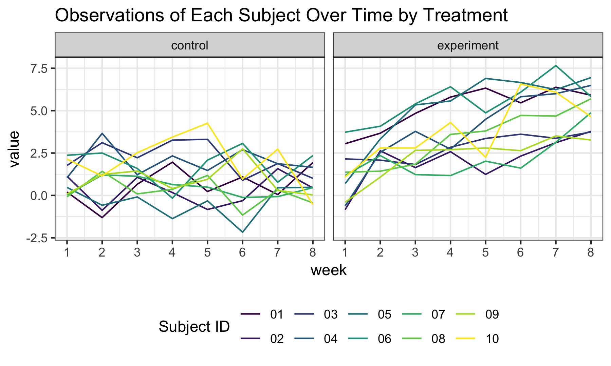
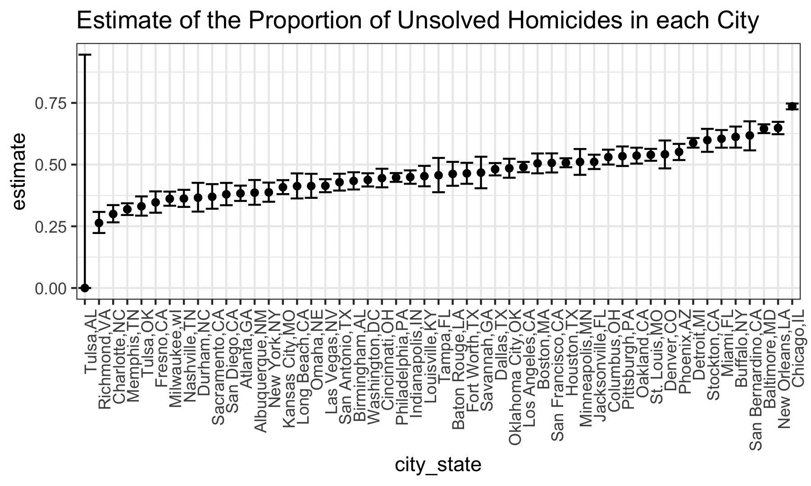

p8105\_hw5\_bs3142
================
Bingyu Sun
11/3/2018

Problem 1
---------

### Data import

``` r
read_study = function(flnm) {
  read_csv(flnm) %>%
    mutate(filename = flnm)
} #create function to read file and a new column for filenames

study_data = 
  list.files(path = "./data/data_exp",
             pattern = "*.csv",
             full.names = TRUE) %>% #get dataframe of filenames with relative file path
  map_df(~read_study(.x)) #read data from each file
```

    ## Parsed with column specification:
    ## cols(
    ##   week_1 = col_double(),
    ##   week_2 = col_double(),
    ##   week_3 = col_double(),
    ##   week_4 = col_double(),
    ##   week_5 = col_double(),
    ##   week_6 = col_double(),
    ##   week_7 = col_double(),
    ##   week_8 = col_double()
    ## )
    ## Parsed with column specification:
    ## cols(
    ##   week_1 = col_double(),
    ##   week_2 = col_double(),
    ##   week_3 = col_double(),
    ##   week_4 = col_double(),
    ##   week_5 = col_double(),
    ##   week_6 = col_double(),
    ##   week_7 = col_double(),
    ##   week_8 = col_double()
    ## )
    ## Parsed with column specification:
    ## cols(
    ##   week_1 = col_double(),
    ##   week_2 = col_double(),
    ##   week_3 = col_double(),
    ##   week_4 = col_double(),
    ##   week_5 = col_double(),
    ##   week_6 = col_double(),
    ##   week_7 = col_double(),
    ##   week_8 = col_double()
    ## )
    ## Parsed with column specification:
    ## cols(
    ##   week_1 = col_double(),
    ##   week_2 = col_double(),
    ##   week_3 = col_double(),
    ##   week_4 = col_double(),
    ##   week_5 = col_double(),
    ##   week_6 = col_double(),
    ##   week_7 = col_double(),
    ##   week_8 = col_double()
    ## )
    ## Parsed with column specification:
    ## cols(
    ##   week_1 = col_double(),
    ##   week_2 = col_double(),
    ##   week_3 = col_double(),
    ##   week_4 = col_double(),
    ##   week_5 = col_double(),
    ##   week_6 = col_double(),
    ##   week_7 = col_double(),
    ##   week_8 = col_double()
    ## )
    ## Parsed with column specification:
    ## cols(
    ##   week_1 = col_double(),
    ##   week_2 = col_double(),
    ##   week_3 = col_double(),
    ##   week_4 = col_double(),
    ##   week_5 = col_double(),
    ##   week_6 = col_double(),
    ##   week_7 = col_double(),
    ##   week_8 = col_double()
    ## )
    ## Parsed with column specification:
    ## cols(
    ##   week_1 = col_double(),
    ##   week_2 = col_double(),
    ##   week_3 = col_double(),
    ##   week_4 = col_double(),
    ##   week_5 = col_double(),
    ##   week_6 = col_double(),
    ##   week_7 = col_double(),
    ##   week_8 = col_double()
    ## )
    ## Parsed with column specification:
    ## cols(
    ##   week_1 = col_double(),
    ##   week_2 = col_double(),
    ##   week_3 = col_double(),
    ##   week_4 = col_double(),
    ##   week_5 = col_double(),
    ##   week_6 = col_double(),
    ##   week_7 = col_double(),
    ##   week_8 = col_double()
    ## )
    ## Parsed with column specification:
    ## cols(
    ##   week_1 = col_double(),
    ##   week_2 = col_double(),
    ##   week_3 = col_double(),
    ##   week_4 = col_double(),
    ##   week_5 = col_double(),
    ##   week_6 = col_double(),
    ##   week_7 = col_double(),
    ##   week_8 = col_double()
    ## )
    ## Parsed with column specification:
    ## cols(
    ##   week_1 = col_double(),
    ##   week_2 = col_double(),
    ##   week_3 = col_double(),
    ##   week_4 = col_double(),
    ##   week_5 = col_double(),
    ##   week_6 = col_double(),
    ##   week_7 = col_double(),
    ##   week_8 = col_double()
    ## )
    ## Parsed with column specification:
    ## cols(
    ##   week_1 = col_double(),
    ##   week_2 = col_double(),
    ##   week_3 = col_double(),
    ##   week_4 = col_double(),
    ##   week_5 = col_double(),
    ##   week_6 = col_double(),
    ##   week_7 = col_double(),
    ##   week_8 = col_double()
    ## )
    ## Parsed with column specification:
    ## cols(
    ##   week_1 = col_double(),
    ##   week_2 = col_double(),
    ##   week_3 = col_double(),
    ##   week_4 = col_double(),
    ##   week_5 = col_double(),
    ##   week_6 = col_double(),
    ##   week_7 = col_double(),
    ##   week_8 = col_double()
    ## )
    ## Parsed with column specification:
    ## cols(
    ##   week_1 = col_double(),
    ##   week_2 = col_double(),
    ##   week_3 = col_double(),
    ##   week_4 = col_double(),
    ##   week_5 = col_double(),
    ##   week_6 = col_double(),
    ##   week_7 = col_double(),
    ##   week_8 = col_double()
    ## )

    ## Parsed with column specification:
    ## cols(
    ##   week_1 = col_double(),
    ##   week_2 = col_double(),
    ##   week_3 = col_double(),
    ##   week_4 = col_double(),
    ##   week_5 = col_double(),
    ##   week_6 = col_double(),
    ##   week_7 = col_integer(),
    ##   week_8 = col_double()
    ## )

    ## Parsed with column specification:
    ## cols(
    ##   week_1 = col_double(),
    ##   week_2 = col_double(),
    ##   week_3 = col_double(),
    ##   week_4 = col_double(),
    ##   week_5 = col_double(),
    ##   week_6 = col_double(),
    ##   week_7 = col_double(),
    ##   week_8 = col_double()
    ## )
    ## Parsed with column specification:
    ## cols(
    ##   week_1 = col_double(),
    ##   week_2 = col_double(),
    ##   week_3 = col_double(),
    ##   week_4 = col_double(),
    ##   week_5 = col_double(),
    ##   week_6 = col_double(),
    ##   week_7 = col_double(),
    ##   week_8 = col_double()
    ## )
    ## Parsed with column specification:
    ## cols(
    ##   week_1 = col_double(),
    ##   week_2 = col_double(),
    ##   week_3 = col_double(),
    ##   week_4 = col_double(),
    ##   week_5 = col_double(),
    ##   week_6 = col_double(),
    ##   week_7 = col_double(),
    ##   week_8 = col_double()
    ## )
    ## Parsed with column specification:
    ## cols(
    ##   week_1 = col_double(),
    ##   week_2 = col_double(),
    ##   week_3 = col_double(),
    ##   week_4 = col_double(),
    ##   week_5 = col_double(),
    ##   week_6 = col_double(),
    ##   week_7 = col_double(),
    ##   week_8 = col_double()
    ## )
    ## Parsed with column specification:
    ## cols(
    ##   week_1 = col_double(),
    ##   week_2 = col_double(),
    ##   week_3 = col_double(),
    ##   week_4 = col_double(),
    ##   week_5 = col_double(),
    ##   week_6 = col_double(),
    ##   week_7 = col_double(),
    ##   week_8 = col_double()
    ## )
    ## Parsed with column specification:
    ## cols(
    ##   week_1 = col_double(),
    ##   week_2 = col_double(),
    ##   week_3 = col_double(),
    ##   week_4 = col_double(),
    ##   week_5 = col_double(),
    ##   week_6 = col_double(),
    ##   week_7 = col_double(),
    ##   week_8 = col_double()
    ## )

### Data tidying

``` r
tidy_study =
  study_data %>%
  mutate(filename = str_replace_all(filename, c("^./data/data_exp/" = "", ".csv$" = ""))) %>% #clean up filename
  separate(filename, into = c("treatment", "id"), sep = "_") %>% #separate filename to two variables as treatment and id
  mutate(treatment = str_replace_all(treatment, c("con" = "control", "exp" = "experiment"))) %>% #rename con to control, exp to experiment
  gather(key = week, value = value, week_1:week_8) %>% #change to long format
  mutate(week = str_replace(week, "^week_", "")) #clean names of week variable
```

### Spaghetti plot

``` r
tidy_study %>%
  mutate(week = as.numeric(week)) %>%
  group_by(treatment, id) %>% 
  ggplot(aes(x = week, y = value, color = id)) +
  geom_line() +
  facet_grid(~treatment) + #create 2-panel plot by treatment
  labs(
    title = "Observations of Each Subject Over Time by Treatment"
  ) +
  viridis::scale_color_viridis(
    name = "Subject ID",
    discrete = TRUE
  ) +
  scale_x_continuous(breaks = c(1:8)) #plot spagetti plot
```



Comment:

In general, there is an increase in performance over time in the experimental group comparing to the control group, suggesting a positive correlation between treatment and participants' performance in the experiment arm. For controls, the participants' performances fluctuate around baseline, revealing the change in the experimental arm is probably due to treatment.

Problem 2
---------

### Data import

``` r
cases_raw = read_csv("./data/homicide-data.csv") #import data
```

    ## Parsed with column specification:
    ## cols(
    ##   uid = col_character(),
    ##   reported_date = col_integer(),
    ##   victim_last = col_character(),
    ##   victim_first = col_character(),
    ##   victim_race = col_character(),
    ##   victim_age = col_character(),
    ##   victim_sex = col_character(),
    ##   city = col_character(),
    ##   state = col_character(),
    ##   lat = col_double(),
    ##   lon = col_double(),
    ##   disposition = col_character()
    ## )

``` r
str(cases_raw)
```

    ## Classes 'tbl_df', 'tbl' and 'data.frame':    52179 obs. of  12 variables:
    ##  $ uid          : chr  "Alb-000001" "Alb-000002" "Alb-000003" "Alb-000004" ...
    ##  $ reported_date: int  20100504 20100216 20100601 20100101 20100102 20100126 20100127 20100127 20100130 20100210 ...
    ##  $ victim_last  : chr  "GARCIA" "MONTOYA" "SATTERFIELD" "MENDIOLA" ...
    ##  $ victim_first : chr  "JUAN" "CAMERON" "VIVIANA" "CARLOS" ...
    ##  $ victim_race  : chr  "Hispanic" "Hispanic" "White" "Hispanic" ...
    ##  $ victim_age   : chr  "78" "17" "15" "32" ...
    ##  $ victim_sex   : chr  "Male" "Male" "Female" "Male" ...
    ##  $ city         : chr  "Albuquerque" "Albuquerque" "Albuquerque" "Albuquerque" ...
    ##  $ state        : chr  "NM" "NM" "NM" "NM" ...
    ##  $ lat          : num  35.1 35.1 35.1 35.1 35.1 ...
    ##  $ lon          : num  -107 -107 -107 -107 -107 ...
    ##  $ disposition  : chr  "Closed without arrest" "Closed by arrest" "Closed without arrest" "Closed by arrest" ...
    ##  - attr(*, "spec")=List of 2
    ##   ..$ cols   :List of 12
    ##   .. ..$ uid          : list()
    ##   .. .. ..- attr(*, "class")= chr  "collector_character" "collector"
    ##   .. ..$ reported_date: list()
    ##   .. .. ..- attr(*, "class")= chr  "collector_integer" "collector"
    ##   .. ..$ victim_last  : list()
    ##   .. .. ..- attr(*, "class")= chr  "collector_character" "collector"
    ##   .. ..$ victim_first : list()
    ##   .. .. ..- attr(*, "class")= chr  "collector_character" "collector"
    ##   .. ..$ victim_race  : list()
    ##   .. .. ..- attr(*, "class")= chr  "collector_character" "collector"
    ##   .. ..$ victim_age   : list()
    ##   .. .. ..- attr(*, "class")= chr  "collector_character" "collector"
    ##   .. ..$ victim_sex   : list()
    ##   .. .. ..- attr(*, "class")= chr  "collector_character" "collector"
    ##   .. ..$ city         : list()
    ##   .. .. ..- attr(*, "class")= chr  "collector_character" "collector"
    ##   .. ..$ state        : list()
    ##   .. .. ..- attr(*, "class")= chr  "collector_character" "collector"
    ##   .. ..$ lat          : list()
    ##   .. .. ..- attr(*, "class")= chr  "collector_double" "collector"
    ##   .. ..$ lon          : list()
    ##   .. .. ..- attr(*, "class")= chr  "collector_double" "collector"
    ##   .. ..$ disposition  : list()
    ##   .. .. ..- attr(*, "class")= chr  "collector_character" "collector"
    ##   ..$ default: list()
    ##   .. ..- attr(*, "class")= chr  "collector_guess" "collector"
    ##   ..- attr(*, "class")= chr "col_spec"

``` r
names(cases_raw)
```

    ##  [1] "uid"           "reported_date" "victim_last"   "victim_first" 
    ##  [5] "victim_race"   "victim_age"    "victim_sex"    "city"         
    ##  [9] "state"         "lat"           "lon"           "disposition"

**Description**

The dataset consists of homicide information in 50 large U.S. cities, each row is a case showing victim information (name, race, age, sex), murder data, location information (city, state, latitude, longitude), and disposition information of the case. There are a total of **52179** cases.

### Data manipulation

``` r
cases_tidy =
  cases_raw %>%
  mutate(city_state = str_c(city, ",", state)) %>% #get a new variable city_state
  mutate(disposition = str_replace_all(disposition, c("Closed without arrest" = "Unsolved", "Open/No arrest" = "Unsolved"))) #combine two categories to one category called unsolved
```

#### Q & A

**1. Summarize within cities to obtain the total number of homicides, and the number of unsolved homicides (those for which the disposition is “Closed without arrest” or “Open/No arrest”).**

``` r
cases_nest =
  cases_tidy %>%
  group_by(city_state) %>%
  nest() %>% #get dataframes by city
  mutate(
    n_total = map(.x = data, ~ .x %>% 
                    pull(disposition) %>%
                    length()),
    n_unsolved = map(.x = data, ~ .x %>%
                       filter(disposition == "Unsolved") %>%
                       pull(disposition) %>%
                       length())
  ) %>% #get number of homicides and unsolved homicides
  select(-data)

cases_nest %>%
  knitr::kable(digits = 0) #show numbers in a table
```

| city\_state       | n\_total | n\_unsolved |
|:------------------|:---------|:------------|
| Albuquerque,NM    | 378      | 146         |
| Atlanta,GA        | 973      | 373         |
| Baltimore,MD      | 2827     | 1825        |
| Baton Rouge,LA    | 424      | 196         |
| Birmingham,AL     | 800      | 347         |
| Boston,MA         | 614      | 310         |
| Buffalo,NY        | 521      | 319         |
| Charlotte,NC      | 687      | 206         |
| Chicago,IL        | 5535     | 4073        |
| Cincinnati,OH     | 694      | 309         |
| Columbus,OH       | 1084     | 575         |
| Dallas,TX         | 1567     | 754         |
| Denver,CO         | 312      | 169         |
| Detroit,MI        | 2519     | 1482        |
| Durham,NC         | 276      | 101         |
| Fort Worth,TX     | 549      | 255         |
| Fresno,CA         | 487      | 169         |
| Houston,TX        | 2942     | 1493        |
| Indianapolis,IN   | 1322     | 594         |
| Jacksonville,FL   | 1168     | 597         |
| Kansas City,MO    | 1190     | 486         |
| Las Vegas,NV      | 1381     | 572         |
| Long Beach,CA     | 378      | 156         |
| Los Angeles,CA    | 2257     | 1106        |
| Louisville,KY     | 576      | 261         |
| Memphis,TN        | 1514     | 483         |
| Miami,FL          | 744      | 450         |
| Milwaukee,wI      | 1115     | 403         |
| Minneapolis,MN    | 366      | 187         |
| Nashville,TN      | 767      | 278         |
| New Orleans,LA    | 1434     | 930         |
| New York,NY       | 627      | 243         |
| Oakland,CA        | 947      | 508         |
| Oklahoma City,OK  | 672      | 326         |
| Omaha,NE          | 409      | 169         |
| Philadelphia,PA   | 3037     | 1360        |
| Phoenix,AZ        | 914      | 504         |
| Pittsburgh,PA     | 631      | 337         |
| Richmond,VA       | 429      | 113         |
| San Antonio,TX    | 833      | 357         |
| Sacramento,CA     | 376      | 139         |
| Savannah,GA       | 246      | 115         |
| San Bernardino,CA | 275      | 170         |
| San Diego,CA      | 461      | 175         |
| San Francisco,CA  | 663      | 336         |
| St. Louis,MO      | 1677     | 905         |
| Stockton,CA       | 444      | 266         |
| Tampa,FL          | 208      | 95          |
| Tulsa,OK          | 583      | 193         |
| Tulsa,AL          | 1        | 0           |
| Washington,DC     | 1345     | 589         |

**2. For the city of Baltimore, MD, use the prop.test function to estimate the proportion of homicides that are unsolved; save the output of prop.test as an R object, apply the broom::tidy to this object and pull the estimated proportion and confidence intervals from the resulting tidy dataframe.**

``` r
bal_result = prop.test(cases_nest$n_unsolved[[3]], cases_nest$n_total[[3]]) #prop.test for Baltimore

tibble(
  estimate = broom::tidy(bal_result) %>% pull(estimate),
  conf.low = broom::tidy(bal_result) %>% pull(conf.low),
  conf.high = broom::tidy(bal_result) %>% pull(conf.high)
) #show results in a dataframe
```

    ## # A tibble: 1 x 3
    ##   estimate conf.low conf.high
    ##      <dbl>    <dbl>     <dbl>
    ## 1    0.646    0.628     0.663

**3. Run prop.test for each of the cities in your dataset, and extract both the proportion of unsolved homicides and the confidence interval for each. Do this within a “tidy” pipeline, making use of purrr::map, purrr::map2, list columns and unnest as necessary to create a tidy dataframe with estimated proportions and CIs for each city.**

``` r
prop_test = function(x, n) {
  
  prop_result = prop.test(x, n)
  
  tibble(estimate = broom::tidy(prop_result) %>% pull(estimate),
         conf.low = broom::tidy(prop_result) %>% pull(conf.low),
         conf.high = broom::tidy(prop_result) %>% pull(conf.high)
         )
  
} #create a function to show statistics of interest in a dataframe

prop_test_results = 
  cases_nest %>%
  mutate(statistics = map2(.x = cases_nest$n_unsolved, .y = cases_nest$n_total, 
                           ~ prop_test(x = .x, n = .y))) %>% #a new variable for test statistics applies to each sub-dataframes
  select(city_state, statistics) %>%
  unnest() #convert back to one dataframe
```

    ## Warning in prop.test(x, n): Chi-squared approximation may be incorrect

``` r
prop_test_results %>%
  knitr::kable(digits = 3) #show result in a table
```

| city\_state       |  estimate|  conf.low|  conf.high|
|:------------------|---------:|---------:|----------:|
| Albuquerque,NM    |     0.386|     0.337|      0.438|
| Atlanta,GA        |     0.383|     0.353|      0.415|
| Baltimore,MD      |     0.646|     0.628|      0.663|
| Baton Rouge,LA    |     0.462|     0.414|      0.511|
| Birmingham,AL     |     0.434|     0.399|      0.469|
| Boston,MA         |     0.505|     0.465|      0.545|
| Buffalo,NY        |     0.612|     0.569|      0.654|
| Charlotte,NC      |     0.300|     0.266|      0.336|
| Chicago,IL        |     0.736|     0.724|      0.747|
| Cincinnati,OH     |     0.445|     0.408|      0.483|
| Columbus,OH       |     0.530|     0.500|      0.560|
| Dallas,TX         |     0.481|     0.456|      0.506|
| Denver,CO         |     0.542|     0.485|      0.598|
| Detroit,MI        |     0.588|     0.569|      0.608|
| Durham,NC         |     0.366|     0.310|      0.426|
| Fort Worth,TX     |     0.464|     0.422|      0.507|
| Fresno,CA         |     0.347|     0.305|      0.391|
| Houston,TX        |     0.507|     0.489|      0.526|
| Indianapolis,IN   |     0.449|     0.422|      0.477|
| Jacksonville,FL   |     0.511|     0.482|      0.540|
| Kansas City,MO    |     0.408|     0.380|      0.437|
| Las Vegas,NV      |     0.414|     0.388|      0.441|
| Long Beach,CA     |     0.413|     0.363|      0.464|
| Los Angeles,CA    |     0.490|     0.469|      0.511|
| Louisville,KY     |     0.453|     0.412|      0.495|
| Memphis,TN        |     0.319|     0.296|      0.343|
| Miami,FL          |     0.605|     0.569|      0.640|
| Milwaukee,wI      |     0.361|     0.333|      0.391|
| Minneapolis,MN    |     0.511|     0.459|      0.563|
| Nashville,TN      |     0.362|     0.329|      0.398|
| New Orleans,LA    |     0.649|     0.623|      0.673|
| New York,NY       |     0.388|     0.349|      0.427|
| Oakland,CA        |     0.536|     0.504|      0.569|
| Oklahoma City,OK  |     0.485|     0.447|      0.524|
| Omaha,NE          |     0.413|     0.365|      0.463|
| Philadelphia,PA   |     0.448|     0.430|      0.466|
| Phoenix,AZ        |     0.551|     0.518|      0.584|
| Pittsburgh,PA     |     0.534|     0.494|      0.573|
| Richmond,VA       |     0.263|     0.223|      0.308|
| San Antonio,TX    |     0.429|     0.395|      0.463|
| Sacramento,CA     |     0.370|     0.321|      0.421|
| Savannah,GA       |     0.467|     0.404|      0.532|
| San Bernardino,CA |     0.618|     0.558|      0.675|
| San Diego,CA      |     0.380|     0.335|      0.426|
| San Francisco,CA  |     0.507|     0.468|      0.545|
| St. Louis,MO      |     0.540|     0.515|      0.564|
| Stockton,CA       |     0.599|     0.552|      0.645|
| Tampa,FL          |     0.457|     0.388|      0.527|
| Tulsa,OK          |     0.331|     0.293|      0.371|
| Tulsa,AL          |     0.000|     0.000|      0.945|
| Washington,DC     |     0.438|     0.411|      0.465|

**4. Create a plot that shows the estimates and CIs for each city – check out geom\_errorbar for a way to add error bars based on the upper and lower limits. Organize cities according to the proportion of unsolved homicides.**

``` r
prop_test_results %>%
  mutate(city_state = forcats::fct_reorder(city_state, estimate)) %>% #reorder x-axis variable based on estimate
  ggplot(aes(x = city_state, y = estimate)) +
  geom_point() +
  geom_errorbar(aes(ymin = conf.low, ymax = conf.high)) + #add errorbar
  theme(axis.text.x = element_text(angle = 90, hjust = 1)) +
  labs(
    title = "Estimate of the Proportion of Unsolved Homicides in each City"
  ) #plot scatterplot
```


